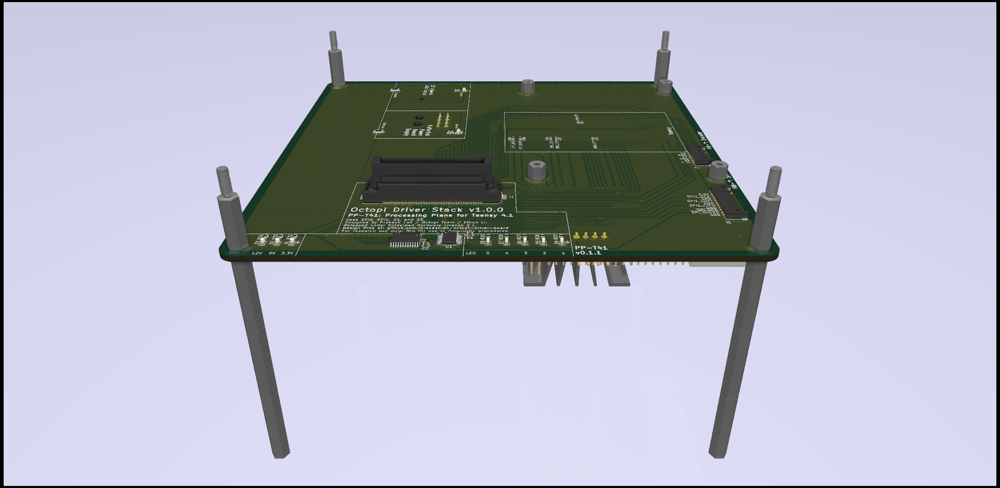

# Processing Plane for Teensy 4.1 _(ODSv1.0.0-PP-T41)_

Central processing, control, and computation for the Octopi Driver Stack

This processing plane contains a [Teensy 4.1](https://www.pjrc.com/store/teensy41.html) microcontroller board and performs central control of all other devices in the driver stack. It also provides mounting holes for an [NVIDIA Jetson Nano Developer Kit](https://developer.nvidia.com/EMBEDDED/jetson-nano-developer-kit) which integrates the microcontroller with image acquisition and graphical user interfacing functionality. Each stack should have exactly one of these planes.

## Background

The Teensy 4.0/4.1, based on NXP Semiconductor's [i.MX RT1060](https://www.nxp.com/products/processors-and-microcontrollers/arm-microcontrollers/i-mx-rt-crossover-mcus/i-mx-rt1060-crossover-mcu-with-arm-cortex-m7-core:i.MX-RT1060) [Crossover Processor](https://www.nxp.com/docs/en/white-paper/I.MXRT1050WP.pdf), is the fastest microcontroller development board in existence. The i.MX RT1060 has an ARM Cortex-M7 core with a CPU clock speed of up to 600 MHz, 1 MB of RAM, and a dedicated floating-point math unit.

This plane is designed to provide the following functionalities:

- Low-level and real-time control, with the Teensy 4.1
- (Optionally) High-level computation, with the NVIDIA Jetson Nano
- Human-machine interfacing, delegated to a peripheral board
- Mechanical base for all other planes in the driver stack
- Module switching for the backbone's hierarchical SPI chip-select multiplexing system

This plane is associated with the following daughter boards:

- Teensy 4.1 [with male headers](https://www.pjrc.com/store/teensy41_pins.html], on the bottom face of the plane at the right edge of the board.
- NVIDIA Jetson Nano Developer Kit on the bottom face of the plane at the right edge of the board, but only through standoffs for mechanical mounting. The Teensy 4.1 is intended to be connected to the Jetson Nano through a short USB cable for power and data.

This plane is associated with the following peripheral boards:

- HB-Sm: HMI Board with Small Interface

This plane has the following internal features:

- 0 Ohm resistor pads to choose whether 12 V power is taken from the 12 V DC barrel jack or from a Pufferfish Power Board
- A 220 uF bulk capacitor on the 12 V power supply input

This plane has the following mechanical stacking specifications:

- This plane must be placed at the bottom of the driver stack.
- The top face of the board requires a between-board separation of 15 mm from the plane above it.
- The bottom face of the board requires a separation of 75 mm from the surface on which this plane is placed, to allow sufficient clearance for the Jetson Nano Developer Kit and a cooling fan which may be placed on its heatsink.

This plane has the following external connectors:

- [Molex Ultra-Fit 2x4 Header](https://www.molex.com/molex/products/part-detail/pcb_headers/1723161108) for receiving power from a Pufferfish Power Board, at the left edge of the board.
- [12 V DC Barrel Jack](https://www.digikey.com/en/products/detail/cui-devices/PJ-037AH-SMT-TR/1530998) for external power supply from a wall wart, at the left edge of the board. The dimensions of this barrel jack are the same as for the Arduino Uno.
- A [10-pin Molex Pico-Lock Header](https://www.digikey.com/en/products/detail/molex/5040501091/4357650) and a [6-pin Molex Pico-Lock Header](https://www.digikey.com/en/products/detail/molex/5040500691/4357148) at the right edge of the board to interface with HB-Sm.

This plane has the following backbone power interface:

- Power output: 3.3 V and 5 V from the Teensy board, and 12 V from the external supply. To avoid power supply contention, no other plane should output power onto the corresponding pins in the backbone.

This plane has the following backbone data interface:

- GPIO input/output: almost all GPIO pins from the Teensy are exposed for other planes to interface with.
- GPIO output: Pins 22 and 23 of the Teensy are exposed over the backbone but are also connected to outputs from HB-Sm; they should not be used by other planes.
- Serial comunication: Most GPIO pins which correspond to I2C and CAN buses and or to UART Serial connections are reserved for those purposes and laid out in a special section of the backbone for other planes to interface with. Both SPI buses from the Teensy are also exposed over the backbone for other planes to interface with. SPI1 is used for peripheral boards and devices such as HB-Sm, while SPI0 is to intended for use by planes.
- SPI chip-select multiplexing: this board reserves the DSCS0 line for on-board devices and for HB-Sm; the DSCS0 line is not exposed over the backbone. This board exposes DSCS1 - DSCS15 for other planes to use.

## Maintainers

Currently the maintainer of this board is [Ethan Li](https://github.com/ethanjli).

## License

Copyright Prakash Lab and the Octopi project contributors.

SPDX-License-Identifier: Apache-2.0 WITH SHL-2.1

All work in this directory is licensed under the [Solderpad Hardware License v2.1](LICENSE) (the “License”); you may not use files except in compliance with the License, or, at your option, the [Apache License version 2.0](LICENSE.Apache). You may obtain a copy of the License at https://solderpad.org/licenses/SHL-2.1/

Unless required by applicable law or agreed to in writing, any work distributed under the License is distributed on an “AS IS” BASIS, WITHOUT WARRANTIES OR CONDITIONS OF ANY KIND, either express or implied. See the License for the specific language governing permissions and limitations under the License.
